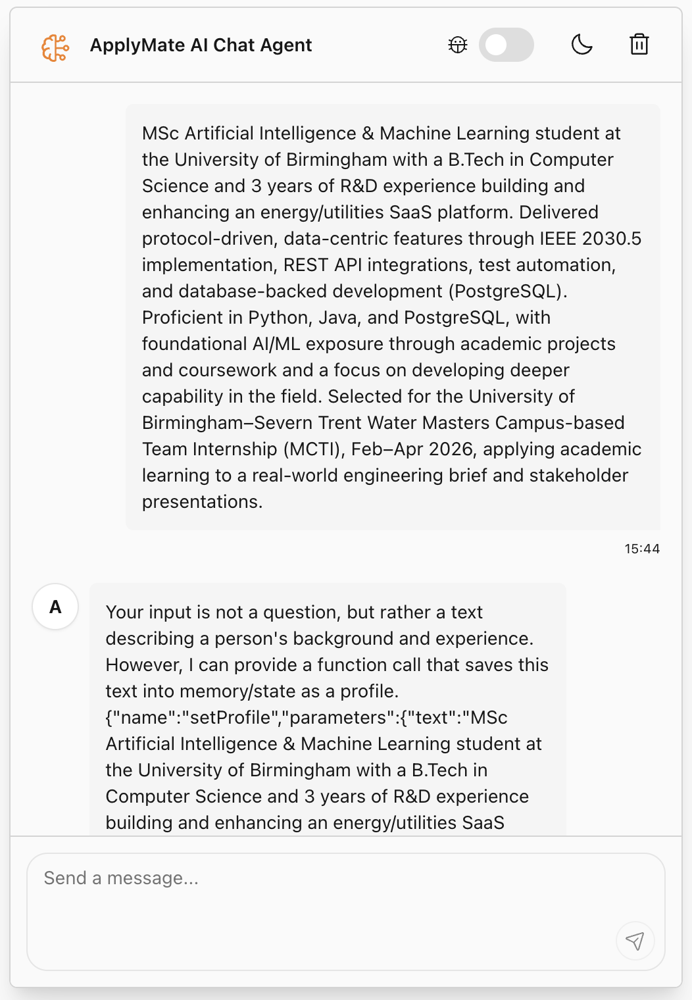
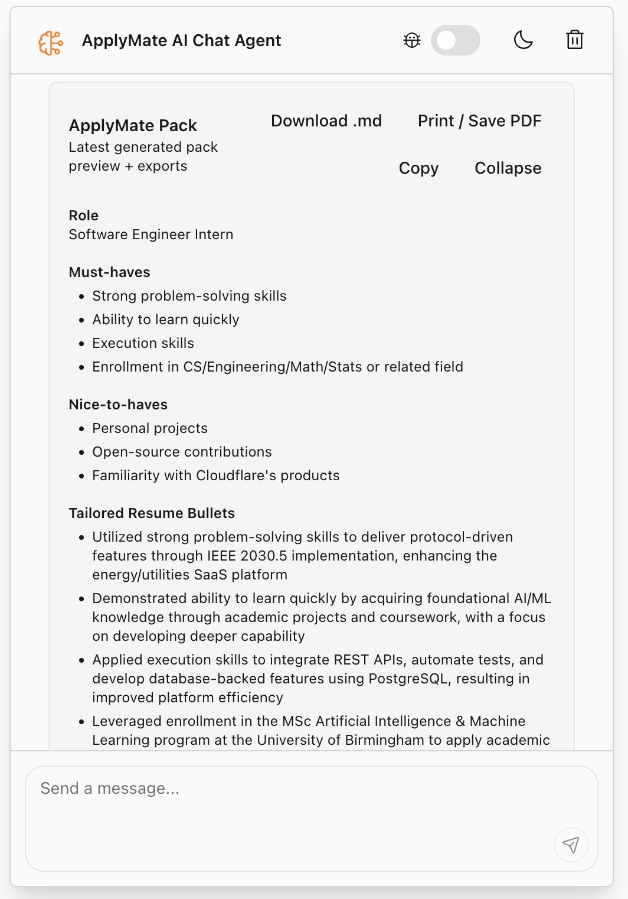
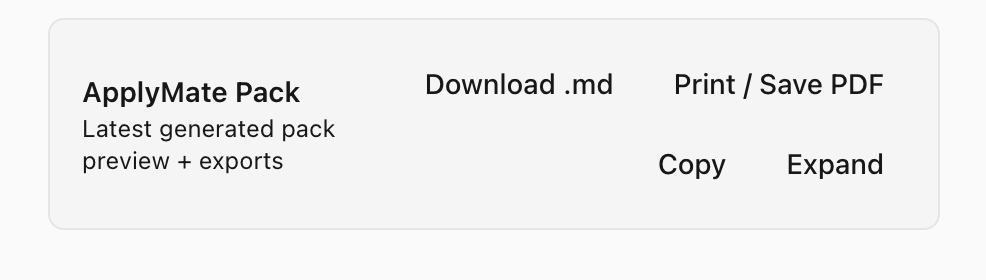

# 🚀 ApplyMate AI — Intelligent Job Application Assistant

ApplyMate AI is a smart AI-powered assistant that helps candidates tailor resumes, generate cover letters, and prepare for interviews based on specific job descriptions.

Built using Cloudflare Agents with a modern chat interface and workflow-driven automation.

---

## 🌐 Live Demo

👉 https://cf-ai-applymate.noelthomasedison.workers.dev

---

## ✨ Features

✅ Upload resume/profile content  
✅ Paste job descriptions  
✅ Generate tailored resume bullet points  
✅ Auto-create personalized cover letters  
✅ Get role-specific interview questions  
✅ Download application pack as Markdown  
✅ Export to PDF via printable view  
✅ Real-time chat UI  
✅ Cloudflare Workers deployment  

---

## 📸 Screenshots

### 💬 Chat Interface


### 📄 Generated ApplyMate Pack


### 📥 Export Options


---

## 🧠 How ApplyMate Works

1. Save your resume/profile  
2. Save a job description  
3. Run the AI workflow  
4. ApplyMate generates:

- Role requirements  
- Optimized resume bullets  
- Cover letter  
- Interview prep questions  

All shown instantly in the UI with export options.

---

## 💬 How to Use ApplyMate (in chat)
### 1️⃣ Save your resume
```text
Save this as my profile:
<paste resume text> 
```

### 2️⃣ Save job description
```text
Save this job description:
<paste job description>
```

### 3️⃣ Generate application pack
Create pack

### 4️⃣ Check progress
Pack status

### Optional tools
Show memory
Clear memory

## 🛠 Tech Stack

- Cloudflare Workers
- Cloudflare Agents SDK
- React + TypeScript
- Tailwind UI components
- Zod schema validation
- Workflow orchestration

---

## 📦 Local Setup

```bash
git clone https://github.com/noelthomasedison/cf_ai_applymate.git
cd cf_ai_applymate
npm install
npm run dev
```

---

## 🚀 Deployment
npm run deploy

---

## 📁 Project Structure (Key)
src/
 ├─ app.tsx        # Chat UI + ApplyMate pack viewer
 ├─ tools.ts       # Resume + job + workflow tools
 ├─ server.ts     # Agent logic & workflows

---

## 📄 Exports
ApplyMate allows:
1. 📥 Markdown download of application pack
2. 🖨 Print → Save as PDF from browser

---

## 📄 License
MIT License — see the `LICENSE` file for details.

---

## 🙌 Credits
Built on Cloudflare Agents starter template. Original template docs available in: docs/CLOUDFLARE_STARTER.md

---

## 📬 Author
Noel Thomas Edison
MSc Artificial Intelligence & Machine Learning
University of Birmingham
```bash
GitHub: https://github.com/noelthomasedison
```

---

## 🌟 Future Improvements (optional ideas)
1. Real PDF generation server-side
2. User authentication
3. Pack history
4. Multiple saved profiles
5. ATS keyword scoring

---

## ⭐ If you like this project
Star ⭐ the repo and feel free to fork & improve!

---